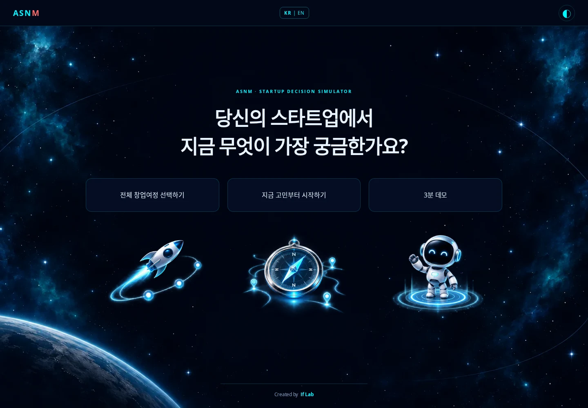
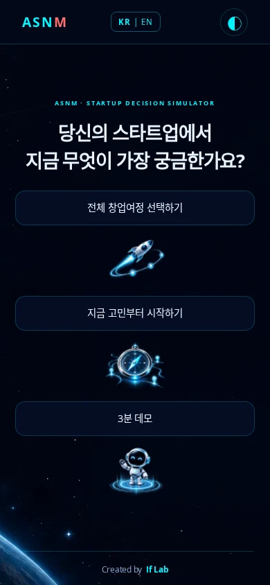
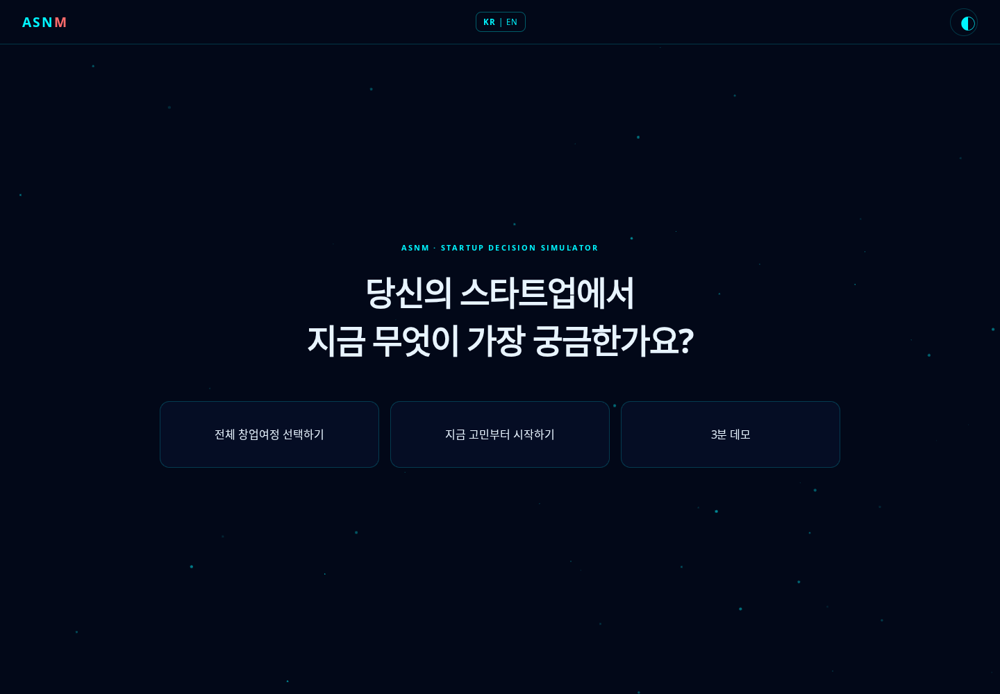
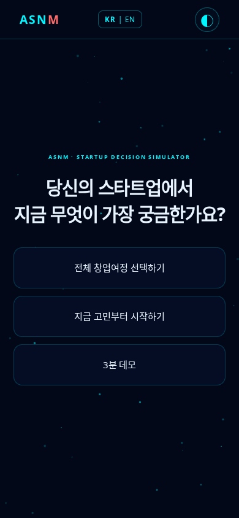
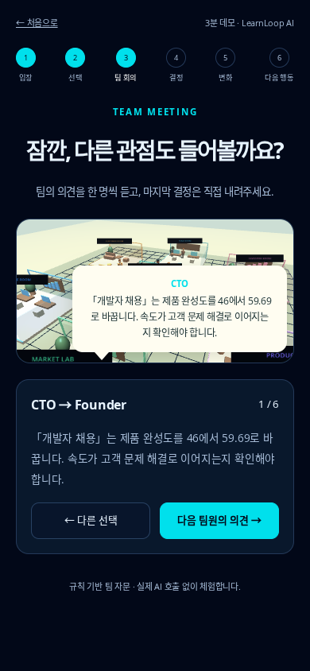

# Focused landing and guided demo — 2026-10-09

## Approved space-art follow-up

After visual approval, the landing now uses a restrained space background and three matching illustrations **below** the entry labels: a journey rocket, a decision compass and a demo guide robot. The HTML footer reads **Created by If Lab**. Illustrations share their button's click/keyboard destination; none of the actual labels or controls are baked into an image. The main hero remains one question and three choices.

The two generated, WebP-encoded assets total 503,630 bytes. Their source prompts and dimensions are documented in [assets/README.md](assets/README.md). Both language routes share these assets. The light theme and reduced-motion behavior are retained; failed artwork requests do not block navigation.

Executed after this follow-up: **33 unit/integration tests**, **11 entry/demo browser groups**, and **11 new artwork browser groups** all passed. Desktop and mobile screenshots were visually inspected. The earlier 15-group full-workspace regression below was performed before this presentation-only artwork addition; it was not rerun for the image addition.

This revision follows the founder's request to simplify the first experience. It is based on deployed V4 commit `7cb2af68912489e7840cb728e4229fd153363556`.

## What changed

- One question and exactly three primary entry choices on the Korean/English landing. The original navy/cyan palette and particle background return, with light-theme and reduced-motion support.
- Removed the V4 research headline, long marketing sections, repeated calls to action and preview panel from the visible landing. Original research content and methodology remain intact elsewhere.
- Full journey opens a separate screen with the four existing modules and “Start with Module 1?” before entering Market Discovery.
- Question-first opens a separate screen with one question per module and optional free text. A bounded, local keyword router handles Korean and English. Ambiguous or unmatched questions ask the user to select a module instead of guessing; no text is sent to an AI provider. A typed market question pre-fills market search without executing it. A typed decision question follows the user into setup.
- The demo is now six small screens: arrive as CEO → select a move → hear six viewpoints one at a time → review/commit → three modeled changes → three next actions. A 3D meeting and speech bubbles accompany the discussion, with a complete 2D fallback.
- Demo position survives refresh in the same tab. Choice drafts and completed decisions retain the existing session format. The demo uses explicitly labeled rule-based advice; optional live AI remains in the full workspace.
- Comparison and the full workspace are available after the guided demo. Existing personal-venture and classic immersive flows remain available.
- Speech bubbles are constrained using their rendered height so they do not clip below short mobile canvases.

## Implementation files

- `product/landing.js`: focused entry screens, history navigation and local question handoff.
- `product/question-router.js`: pure, local question-to-module rules.
- `product/guided-demo.js`: presentation-only walkthrough.
- `product/world-app.js`: walkthrough integration using the original state, draft, save and commit paths.
- `product/product.css`: original-theme entry screens and responsive demo styling.
- `product/tests/entry.test.js`, `product/tests/entry-browser.cjs`: new routing and acceptance coverage.
- `product/tests/browser.cjs`: existing regression coverage adapted to the new entries; full demo workspace tested with `view=workspace`.

## Executed verification

- **33 Node tests passed**: the original 32 plus bilingual question routing, ambiguity and decision-style routing.
- **11 new browser groups passed**: KO/EN landing, four-module entry/confirmation, Back/refresh, typed routing and safe text rendering, all six demo stages, one-at-a-time discussion, draft restore, exactly one committed month, comparison continuation, keyboard/light theme, mobile 390px and speech-bubble bounds, unavailable WebGL plus blocked local/session storage.
- **15 existing product browser groups passed**: personal startup setup, draft restore, lazy 3D race, role/movement/cameras, import/export, A/B state isolation, journal/action plan, AI unavailable/malformed/read-only fixtures, mobile overflow, speech text fallback, feedback, multi-tab conflict, full KO/EN Module 1–4 handoff and original report, lost/unavailable WebGL and blocked storage.
- Desktop 1440×1000 and mobile 390×844 screenshots were visually inspected.
- Protected-source hash checks matched deployed main for both original home HTML files, research HTML, handoff bridge, Module3Adapter and all four simulation engines.

## Review screenshots

## Boundaries

Question routing is a local keyword aid, not semantic LLM understanding. The walkthrough intentionally uses the existing rule-based team and deterministic engine. This UI change does not deploy the separate Cloudflare worker or verify live LLM/microphone behavior. Browser tests use automated Chromium; human engagement and three-minute comprehension still need founder testing. Publication is tracked by the pull request, separately from implementation/test completion.
